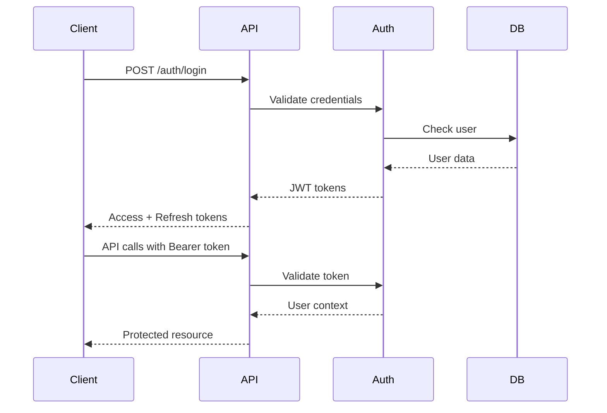

# API Specification - AI Social Media Management Platform

This document provides complete API specifications for the backend services required by the AI Social Media Management Platform.

## 🏗 API Architecture Overview

```
Frontend (React) ↔ REST API ↔ Database (PostgreSQL)
                 ↔ WebSocket ↔ Redis (Real-time)
                 ↔ AI Services ↔ External APIs
```

## 🔐 Authentication & Authorization

### Authentication Flow



### Token Structure

```javascript
// Access Token (JWT)
{
  "sub": "user_id",
  "email": "user@example.com",
  "role": "user",
  "subscription": "pro",
  "iat": 1634567890,
  "exp": 1634571490, // 1 hour
  "iss": "social-media-platform"
}

// Refresh Token
{
  "sub": "user_id",
  "type": "refresh",
  "iat": 1634567890,
  "exp": 1642343890, // 90 days
  "jti": "unique_token_id"
}
```

## 📡 REST API Endpoints

### Base Configuration
- **Base URL:** `https://api.yourdomain.com/v1`
- **Content-Type:** `application/json`
- **Authentication:** `Bearer <access_token>`

---

## 🔑 Authentication Endpoints

### POST /auth/register
Register a new user account

**Request:**
```json
{
  "email": "user@example.com",
  "password": "securePassword123",
  "name": "John Doe",
  "company": "Tech Corp"
}
```

**Response (201):**
```json
{
  "success": true,
  "data": {
    "user": {
      "id": "usr_1234567890",
      "email": "user@example.com",
      "name": "John Doe",
      "avatar": null,
      "subscription": "starter",
      "createdAt": "2024-09-15T10:30:00Z"
    },
    "tokens": {
      "accessToken": "eyJhbGciOiJIUzI1NiIs...",
      "refreshToken": "eyJhbGciOiJIUzI1NiIs...",
      "expiresIn": 3600
    }
  }
}
```

### POST /auth/login
Authenticate user and get tokens

**Request:**
```json
{
  "email": "user@example.com",
  "password": "securePassword123"
}
```

**Response (200):**
```json
{
  "success": true,
  "data": {
    "user": {
      "id": "usr_1234567890",
      "email": "user@example.com",
      "name": "John Doe",
      "avatar": "https://cdn.example.com/avatars/user.jpg",
      "subscription": "pro",
      "lastLogin": "2024-09-15T10:30:00Z"
    },
    "tokens": {
      "accessToken": "eyJhbGciOiJIUzI1NiIs...",
      "refreshToken": "eyJhbGciOiJIUzI1NiIs...",
      "expiresIn": 3600
    }
  }
}
```

### POST /auth/refresh
Refresh access token

**Request:**
```json
{
  "refreshToken": "eyJhbGciOiJIUzI1NiIs..."
}
```

**Response (200):**
```json
{
  "success": true,
  "data": {
    "accessToken": "eyJhbGciOiJIUzI1NiIs...",
    "expiresIn": 3600
  }
}
```

### POST /auth/logout
Logout user and invalidate tokens

**Request:**
```json
{
  "refreshToken": "eyJhbGciOiJIUzI1NiIs..."
}
```

**Response (200):**
```json
{
  "success": true,
  "message": "Successfully logged out"
}
```

---

## 👤 User Management Endpoints

### GET /user/profile
Get current user profile

**Headers:** `Authorization: Bearer <token>`

**Response (200):**
```json
{
  "success": true,
  "data": {
    "id": "usr_1234567890",
    "email": "user@example.com",
    "name": "John Doe",
    "avatar": "https://cdn.example.com/avatars/user.jpg",
    "bio": "Marketing professional focused on AI-driven strategies",
    "timezone": "America/New_York",
    "subscription": {
      "plan": "pro",
      "status": "active",
      "nextBilling": "2024-10-15T00:00:00Z",
      "features": ["15 Social Accounts", "200 Posts/month", "Advanced Analytics"]
    },
    "settings": {
      "notifications": {
        "email": true,
        "push": false,
        "sms": false
      },
      "privacy": {
        "profileVisibility": "private",
        "dataSharing": false
      }
    },
    "createdAt": "2024-01-15T10:30:00Z",
    "updatedAt": "2024-09-15T10:30:00Z"
  }
}
```

### PUT /user/profile
Update user profile

**Request:**
```json
{
  "name": "John Smith",
  "bio": "Updated bio text",
  "timezone": "America/Los_Angeles",
  "avatar": "base64_image_data_or_url"
}
```

**Response (200):**
```json
{
  "success": true,
  "data": {
    "id": "usr_1234567890",
    "name": "John Smith",
    "bio": "Updated bio text",
    "timezone": "America/Los_Angeles",
    "avatar": "https://cdn.example.com/avatars/user_updated.jpg",
    "updatedAt": "2024-09-15T11:30:00Z"
  }
}
```

---

## 📊 Dashboard Endpoints

### GET /dashboard/metrics
Get dashboard performance metrics

**Query Parameters:**
- `timeRange`: `7d`, `30d`, `90d`, `1y` (default: `30d`)
- `platforms`: comma-separated platform IDs (optional)

**Response (200):**
```json
{
  "success": true,
  "data": {
    "overview": {
      "engagementRate": {
        "current": 4.2,
        "previous": 3.7,
        "change": 13.5,
        "trend": "up"
      },
      "totalReach": {
        "current": 125000,
        "previous": 115000,
        "change": 8.7,
        "trend": "up"
      },
      "followersGrowth": {
        "current": 156,
        "previous": 134,
        "change": 16.4,
        "trend": "up"
      },
      "postsPublished": {
        "current": 24,
        "previous": 22,
        "change": 9.1,
        "trend": "up"
      },
      "revenue": {
        "current": 8420,
        "previous": 7890,
        "change": 6.7,
        "trend": "up"
      },
      "conversionRate": {
        "current": 3.8,
        "previous": 3.2,
        "change": 18.8,
        "trend": "up"
      },
      "clickThroughRate": {
        "current": 2.1,
        "previous": 1.9,
        "change": 10.5,
        "trend": "up"
      },
      "costPerClick": {
        "current": 0.45,
        "previous": 0.52,
        "change": -13.5,
        "trend": "down"
      }
    },
    "campaigns": {
      "active": 3,
      "pending": 2,
      "completed": 8,
      "totalBudget": 15000,
      "spent": 8420
    },
    "platforms": [
      {
        "platform": "instagram",
        "reach": 45000,
        "engagement": 3200,
        "followers": 5200,
        "posts": 12,
        "revenue": 3200
      },
      {
        "platform": "facebook",
        "reach": 32000,
        "engagement": 2100,
        "followers": 4100,
        "posts": 8,
        "revenue": 2100
      }
    ],
    "updatedAt": "2024-09-15T10:30:00Z"
  }
}
```

### GET /dashboard/agents
Get AI agent status and activity

**Response (200):**
```json
{
  "success": true,
  "data": {
    "agents": [
      {
        "id": "intelligence",
        "name": "Intelligence Agent",
        "efficiency": 94,
        "status": "active",
        "currentTask": "Analyzing competitor strategies",
        "tasksCompleted": 127,
        "tasksInProgress": 3,
        "averageTime": 45,
        "successRate": 98.5,
        "nextAction": "Complete market analysis report",
        "priority": "high",
        "lastUpdate": "2024-09-15T10:25:00Z"
      },
      {
        "id": "strategy",
        "name": "Strategy Agent",
        "efficiency": 91,
        "status": "active",
        "currentTask": "Planning Q1 content strategy",
        "tasksCompleted": 89,
        "tasksInProgress": 2,
        "averageTime": 62,
        "successRate": 96.2,
        "nextAction": "Finalize content calendar",
        "priority": "medium",
        "lastUpdate": "2024-09-15T10:20:00Z"
      },
      {
        "id": "content",
        "name": "Content Agent",
        "efficiency": 96,
        "status": "active",
        "currentTask": "Creating Instagram carousel",
        "tasksCompleted": 234,
        "tasksInProgress": 5,
        "averageTime": 28,
        "successRate": 99.1,
        "nextAction": "Generate video script",
        "priority": "high",
        "lastUpdate": "2024-09-15T10:28:00Z"
      },
      {
        "id": "execution",
        "name": "Execution Agent",
        "efficiency": 88,
        "status": "active",
        "currentTask": "Scheduling 14 posts",
        "tasksCompleted": 156,
        "tasksInProgress": 4,
        "averageTime": 15,
        "successRate": 97.8,
        "nextAction": "Publish scheduled content",
        "priority": "medium",
        "lastUpdate": "2024-09-15T10:30:00Z"
      },
      {
        "id": "learning",
        "name": "Learning Agent",
        "efficiency": 92,
        "status": "active",
        "currentTask": "Optimizing posting times",
        "tasksCompleted": 78,
        "tasksInProgress": 2,
        "averageTime": 120,
        "successRate": 94.7,
        "nextAction": "Update recommendation model",
        "priority": "low",
        "lastUpdate": "2024-09-15T10:15:00Z"
      },
      {
        "id": "engagement",
        "name": "Engagement Agent",
        "efficiency": 89,
        "status": "active",
        "currentTask": "Responding to 23 comments",
        "tasksCompleted": 312,
        "tasksInProgress": 8,
        "averageTime": 8,
        "successRate": 96.5,
        "nextAction": "Monitor brand mentions",
        "priority": "high",
        "lastUpdate": "2024-09-15T10:29:00Z"
      },
      {
        "id": "analytics",
        "name": "Analytics Agent",
        "efficiency": 95,
        "status": "active",
        "currentTask": "Generating weekly report",
        "tasksCompleted": 45,
        "tasksInProgress": 1,
        "averageTime": 180,
        "successRate": 99.8,
        "nextAction": "Compile performance insights",
        "priority": "medium",
        "lastUpdate": "2024-09-15T10:22:00Z"
      }
    ],
    "overallEfficiency": 92,
    "totalTasksCompleted": 1041,
    "totalTasksInProgress": 25,
    "systemStatus": "optimal",
    "lastUpdate": "2024-09-15T10:30:00Z"
  }
}
```

---

## 📈 Analytics Endpoints

### GET /analytics/overview
Get analytics overview data

**Query Parameters:**
- `timeRange`: `7d`, `30d`, `90d`, `1y` (default: `30d`)
- `platforms`: comma-separated platform IDs (optional)

**Response (200):**
```json
{
  "success": true,
  "data": {
    "overview": {
      "totalReach": {
        "value": 125000,
        "change": 15.3,
        "trend": "up"
      },
      "totalEngagement": {
        "value": 8800,
        "change": 8.7,
        "trend": "up"
      },
      "totalFollowers": {
        "value": 12500,
        "change": 12.1,
        "trend": "up"
      },
      "engagementRate": {
        "value": 7.2,
        "change": 2.3,
        "trend": "up"
      }
    },
    "timeRange": "30d",
    "updatedAt": "2024-09-15T10:30:00Z"
  }
}
```

### GET /analytics/trends
Get performance trends data

**Query Parameters:**
- `timeRange`: `7d`, `30d`, `90d`, `1y` (default: `30d`)
- `metric`: `reach`, `engagement`, `followers` (default: `all`)

**Response (200):**
```json
{
  "success": true,
  "data": {
    "trends": [
      {
        "date": "2024-09-01",
        "reach": 3200,
        "engagement": 245,
        "followers": 4850,
        "posts": 2
      },
      {
        "date": "2024-09-02",
        "reach": 3450,
        "engagement": 267,
        "followers": 4865,
        "posts": 1
      }
      // ... more daily data
    ],
    "summary": {
      "totalReach": 125000,
      "totalEngagement": 8800,
      "avgDailyGrowth": 5.2,
      "bestPerformingDay": "2024-09-10"
    }
  }
}
```

### GET /analytics/platforms
Get platform-specific analytics

**Response (200):**
```json
{
  "success": true,
  "data": {
    "platforms": [
      {
        "platform": "instagram",
        "name": "Instagram",
        "posts": 45,
        "reach": 45000,
        "engagement": 3200,
        "followers": 5200,
        "engagementRate": 7.1,
        "topContentType": "carousel",
        "bestPostingTime": "18:00",
        "growth": {
          "reach": 12.5,
          "engagement": 8.3,
          "followers": 15.2
        }
      },
      {
        "platform": "facebook",
        "name": "Facebook",
        "posts": 38,
        "reach": 32000,
        "engagement": 2100,
        "followers": 4100,
        "engagementRate": 6.6,
        "topContentType": "video",
        "bestPostingTime": "20:00",
        "growth": {
          "reach": 8.7,
          "engagement": 5.2,
          "followers": 9.8
        }
      }
    ]
  }
}
```

---

## 📝 Content Management Endpoints

### GET /posts
Get user posts with pagination and filtering

**Query Parameters:**
- `page`: Page number (default: 1)
- `limit`: Items per page (default: 20, max: 100)
- `status`: `draft`, `scheduled`, `published`, `all` (default: `all`)
- `platform`: Platform filter (optional)
- `search`: Search query (optional)
- `sortBy`: `createdAt`, `scheduledAt`, `performance` (default: `createdAt`)
- `sortOrder`: `asc`, `desc` (default: `desc`)

**Response (200):**
```json
{
  "success": true,
  "data": {
    "posts": [
      {
        "id": "post_1234567890",
        "title": "Behind the Scenes: Our AI Development Process",
        "content": "Take a look at how we develop our AI-powered features...",
        "platform": "facebook",
        "postType": "video",
        "status": "scheduled",
        "scheduledAt": "2024-09-16T07:30:00Z",
        "publishedAt": null,
        "media": [
          {
            "type": "video",
            "url": "https://cdn.example.com/videos/ai-process.mp4",
            "thumbnail": "https://cdn.example.com/thumbnails/ai-process.jpg"
          }
        ],
        "hashtags": ["#AI", "#Development", "#BehindTheScenes"],
        "performance": null,
        "aiGenerated": true,
        "aiConfidence": 0.88,
        "createdAt": "2024-09-15T10:30:00Z",
        "updatedAt": "2024-09-15T10:30:00Z"
      },
      {
        "id": "post_1234567891",
        "title": "AI-Powered Social Media Strategy: The Future is Here",
        "content": "Discover how artificial intelligence is revolutionizing social media strategies...",
        "platform": "linkedin",
        "postType": "article",
        "status": "published",
        "scheduledAt": "2024-09-14T04:00:00Z",
        "publishedAt": "2024-09-14T04:00:00Z",
        "media": [
          {
            "type": "image",
            "url": "https://cdn.example.com/images/ai-strategy.jpg",
            "alt": "AI Strategy Infographic"
          }
        ],
        "hashtags": ["#AI", "#SocialMedia", "#Strategy"],
        "performance": {
          "views": 12500,
          "likes": 245,
          "comments": 32,
          "shares": 18,
          "engagementRate": 4.2,
          "clickThroughRate": 2.1
        },
        "aiGenerated": true,
        "aiConfidence": 0.92,
        "createdAt": "2024-09-13T10:30:00Z",
        "updatedAt": "2024-09-14T04:05:00Z"
      }
    ],
    "pagination": {
      "currentPage": 1,
      "totalPages": 3,
      "totalItems": 5,
      "itemsPerPage": 20,
      "hasNextPage": false,
      "hasPreviousPage": false
    },
    "summary": {
      "totalPosts": 5,
      "published": 4,
      "scheduled": 1,
      "drafts": 0,
      "avgEngagement": 4.8
    }
  }
}
```

### POST /posts
Create a new post

**Request:**
```json
{
  "title": "New Post Title",
  "content": "Post content here...",
  "platform": "instagram",
  "postType": "carousel",
  "status": "draft",
  "scheduledAt": "2024-09-16T10:00:00Z",
  "media": [
    {
      "type": "image",
      "url": "https://cdn.example.com/images/post1.jpg",
      "alt": "Post image description"
    }
  ],
  "hashtags": ["#marketing", "#AI"],
  "aiGenerated": false
}
```

**Response (201):**
```json
{
  "success": true,
  "data": {
    "id": "post_1234567892",
    "title": "New Post Title",
    "content": "Post content here...",
    "platform": "instagram",
    "postType": "carousel",
    "status": "draft",
    "scheduledAt": "2024-09-16T10:00:00Z",
    "media": [
      {
        "type": "image",
        "url": "https://cdn.example.com/images/post1.jpg",
        "alt": "Post image description"
      }
    ],
    "hashtags": ["#marketing", "#AI"],
    "aiGenerated": false,
    "createdAt": "2024-09-15T10:30:00Z",
    "updatedAt": "2024-09-15T10:30:00Z"
  }
}
```

### PUT /posts/:id
Update an existing post

**Request:**
```json
{
  "title": "Updated Post Title",
  "content": "Updated content...",
  "scheduledAt": "2024-09-16T12:00:00Z",
  "status": "scheduled"
}
```

**Response (200):**
```json
{
  "success": true,
  "data": {
    "id": "post_1234567892",
    "title": "Updated Post Title",
    "content": "Updated content...",
    "scheduledAt": "2024-09-16T12:00:00Z",
    "status": "scheduled",
    "updatedAt": "2024-09-15T11:00:00Z"
  }
}
```

### DELETE /posts/:id
Delete a post

**Response (200):**
```json
{
  "success": true,
  "message": "Post deleted successfully"
}
```

---

## 🎯 Campaign Management Endpoints

### GET /campaigns
Get user campaigns

**Query Parameters:**
- `status`: `active`, `paused`, `completed`, `all` (default: `all`)
- `platform`: Platform filter (optional)
- `page`: Page number (default: 1)
- `limit`: Items per page (default: 20)

**Response (200):**
```json
{
  "success": true,
  "data": {
    "campaigns": [
      {
        "id": "camp_1234567890",
        "name": "Q4 Product Launch",
        "platform": "facebook",
        "type": "conversion",
        "status": "active",
        "budget": {
          "total": 5000,
          "daily": 100,
          "spent": 2340,
          "remaining": 2660
        },
        "performance": {
          "impressions": 125000,
          "clicks": 2340,
          "conversions": 89,
          "ctr": 1.87,
          "cpc": 1.00,
          "cpa": 26.29,
          "roas": 3.8
        },
        "targeting": {
          "ageRange": "25-45",
          "interests": ["technology", "marketing"],
          "locations": ["United States", "Canada"]
        },
        "schedule": {
          "startDate": "2024-09-01T00:00:00Z",
          "endDate": "2024-12-31T23:59:59Z"
        },
        "createdAt": "2024-08-25T10:30:00Z",
        "updatedAt": "2024-09-15T10:30:00Z"
      }
    ],
    "summary": {
      "totalCampaigns": 12,
      "active": 3,
      "paused": 2,
      "completed": 7,
      "totalBudget": 25000,
      "totalSpent": 18420,
      "avgROAS": 3.2
    }
  }
}
```

### POST /campaigns
Create a new campaign

**Request:**
```json
{
  "name": "New Campaign",
  "platform": "instagram",
  "type": "awareness",
  "budget": {
    "total": 3000,
    "daily": 50
  },
  "targeting": {
    "ageRange": "18-35",
    "interests": ["fitness", "health"],
    "locations": ["United States"]
  },
  "schedule": {
    "startDate": "2024-09-20T00:00:00Z",
    "endDate": "2024-10-20T23:59:59Z"
  },
  "creative": {
    "headline": "Transform Your Fitness Journey",
    "description": "Join thousands who have achieved their goals",
    "media": [
      {
        "type": "image",
        "url": "https://cdn.example.com/campaigns/fitness.jpg"
      }
    ]
  }
}
```

**Response (201):**
```json
{
  "success": true,
  "data": {
    "id": "camp_1234567891",
    "name": "New Campaign",
    "platform": "instagram",
    "type": "awareness",
    "status": "pending_review",
    "budget": {
      "total": 3000,
      "daily": 50,
      "spent": 0,
      "remaining": 3000
    },
    "createdAt": "2024-09-15T10:30:00Z"
  }
}
```

---

## ⚙️ Settings Endpoints

### GET /settings/business
Get business profile settings

**Response (200):**
```json
{
  "success": true,
  "data": {
    "companyName": "TechCorp Solutions",
    "industry": "Technology",
    "businessType": "B2B",
    "companySize": "51-200",
    "website": "https://techcorp.com",
    "foundedYear": 2018,
    "description": "Leading provider of AI-powered business solutions",
    "contact": {
      "email": "contact@techcorp.com",
      "phone": "+1-555-0123",
      "address": "123 Tech Street, San Francisco, CA 94105"
    },
    "marketing": {
      "brandVoice": "professional",
      "contentStyle": "educational",
      "postingFrequency": "daily",
      "targetAudience": "Business professionals and decision makers",
      "businessObjectives": [
        "brand_awareness",
        "lead_generation",
        "customer_engagement"
      ]
    }
  }
}
```

### PUT /settings/business
Update business profile settings

**Request:**
```json
{
  "companyName": "TechCorp Solutions Inc.",
  "description": "Updated company description",
  "marketing": {
    "brandVoice": "friendly",
    "contentStyle": "inspirational",
    "targetAudience": "Updated target audience description"
  }
}
```

**Response (200):**
```json
{
  "success": true,
  "data": {
    "companyName": "TechCorp Solutions Inc.",
    "description": "Updated company description",
    "marketing": {
      "brandVoice": "friendly",
      "contentStyle": "inspirational",
      "targetAudience": "Updated target audience description"
    },
    "updatedAt": "2024-09-15T10:30:00Z"
  }
}
```

### GET /settings/brand
Get brand assets and guidelines

**Response (200):**
```json
{
  "success": true,
  "data": {
    "colors": {
      "primary": "#3B82F6",
      "secondary": "#8B5CF6",
      "accent": "#10B981",
      "background": "#F8FAFC",
      "text": "#1F2937"
    },
    "assets": {
      "primaryLogo": "https://cdn.example.com/brand/logo-primary.png",
      "lightLogo": "https://cdn.example.com/brand/logo-light.png",
      "favicon": "https://cdn.example.com/brand/favicon.ico",
      "watermark": "https://cdn.example.com/brand/watermark.png"
    },
    "guidelines": {
      "brandVoice": "professional",
      "contentStyle": "educational",
      "description": "Our brand represents innovation, reliability, and excellence in AI-powered solutions."
    }
  }
}
```

---

## 🔌 Social Media Integration Endpoints

### GET /social/accounts
Get connected social media accounts

**Response (200):**
```json
{
  "success": true,
  "data": {
    "accounts": [
      {
        "id": "social_1234567890",
        "platform": "instagram",
        "username": "@techcorp",
        "displayName": "TechCorp Solutions",
        "followers": 12500,
        "isConnected": true,
        "permissions": ["read", "write", "publish"],
        "lastSync": "2024-09-15T10:00:00Z",
        "connectedAt": "2024-01-15T10:30:00Z"
      },
      {
        "id": "social_1234567891",
        "platform": "facebook",
        "username": "techcorp.solutions",
        "displayName": "TechCorp Solutions",
        "followers": 8200,
        "isConnected": true,
        "permissions": ["read", "write", "publish"],
        "lastSync": "2024-09-15T09:45:00Z",
        "connectedAt": "2024-01-20T14:20:00Z"
      }
    ]
  }
}
```

### POST /social/connect
Connect a social media account

**Request:**
```json
{
  "platform": "linkedin",
  "authCode": "authorization_code_from_oauth",
  "redirectUri": "https://yourapp.com/auth/callback"
}
```

**Response (200):**
```json
{
  "success": true,
  "data": {
    "id": "social_1234567892",
    "platform": "linkedin",
    "username": "techcorp-solutions",
    "displayName": "TechCorp Solutions",
    "followers": 5100,
    "isConnected": true,
    "permissions": ["read", "write", "publish"],
    "connectedAt": "2024-09-15T10:30:00Z"
  }
}
```

### DELETE /social/accounts/:id
Disconnect a social media account

**Response (200):**
```json
{
  "success": true,
  "message": "Account disconnected successfully"
}
```

---

## 🔄 WebSocket Events

### Connection
```javascript
// Connect to WebSocket
const ws = new WebSocket('wss://api.yourdomain.com/ws?token=<access_token>')

// Authentication message
ws.send(JSON.stringify({
  type: 'auth',
  token: 'access_token'
}))
```

### Real-time Events

#### AI Agent Updates
```javascript
// Received when AI agent status changes
{
  "type": "agent_update",
  "data": {
    "agentId": "intelligence",
    "efficiency": 95,
    "status": "active",
    "currentTask": "Analyzing competitor strategies",
    "progress": 75,
    "estimatedCompletion": "2024-09-15T11:00:00Z"
  }
}
```

#### Performance Metrics Updates
```javascript
// Received when metrics are updated
{
  "type": "metrics_update",
  "data": {
    "metric": "engagement_rate",
    "value": 4.3,
    "change": 2.4,
    "timestamp": "2024-09-15T10:30:00Z"
  }
}
```

#### Post Status Updates
```javascript
// Received when post status changes
{
  "type": "post_status",
  "data": {
    "postId": "post_1234567890",
    "status": "published",
    "publishedAt": "2024-09-15T10:30:00Z",
    "platform": "instagram"
  }
}
```

#### Campaign Updates
```javascript
// Received when campaign performance updates
{
  "type": "campaign_update",
  "data": {
    "campaignId": "camp_1234567890",
    "performance": {
      "impressions": 126000,
      "clicks": 2350,
      "spent": 2350
    },
    "timestamp": "2024-09-15T10:30:00Z"
  }
}
```

#### Notifications
```javascript
// Received for user notifications
{
  "type": "notification",
  "data": {
    "id": "notif_1234567890",
    "title": "Campaign Budget Alert",
    "message": "Your Q4 campaign has spent 80% of its budget",
    "type": "warning",
    "actionUrl": "/campaigns/camp_1234567890",
    "timestamp": "2024-09-15T10:30:00Z"
  }
}
```

---

## 🚨 Error Handling

### Error Response Format
```json
{
  "success": false,
  "error": {
    "code": "VALIDATION_ERROR",
    "message": "Invalid input data",
    "details": [
      {
        "field": "email",
        "message": "Email is required"
      }
    ],
    "timestamp": "2024-09-15T10:30:00Z",
    "requestId": "req_1234567890"
  }
}
```

### HTTP Status Codes
- `200` - Success
- `201` - Created
- `400` - Bad Request
- `401` - Unauthorized
- `403` - Forbidden
- `404` - Not Found
- `422` - Validation Error
- `429` - Rate Limit Exceeded
- `500` - Internal Server Error

### Common Error Codes
- `VALIDATION_ERROR` - Input validation failed
- `AUTHENTICATION_REQUIRED` - Valid authentication required
- `INSUFFICIENT_PERMISSIONS` - User lacks required permissions
- `RESOURCE_NOT_FOUND` - Requested resource not found
- `RATE_LIMIT_EXCEEDED` - API rate limit exceeded
- `EXTERNAL_API_ERROR` - Third-party service error
- `AI_SERVICE_UNAVAILABLE` - AI service temporarily unavailable

---

## 📊 Rate Limiting

### Limits by Subscription
- **Starter**: 1,000 requests/hour
- **Pro**: 5,000 requests/hour  
- **Premium**: 10,000 requests/hour

### Rate Limit Headers
```
X-RateLimit-Limit: 5000
X-RateLimit-Remaining: 4999
X-RateLimit-Reset: 1634571490
```

---

## 🔐 Security Considerations

### API Security
- HTTPS only (TLS 1.2+)
- JWT token authentication
- Rate limiting per user/IP
- Input validation and sanitization
- SQL injection prevention
- CORS configuration

### Data Protection
- Encryption at rest and in transit
- PII data handling compliance
- Regular security audits
- Access logging and monitoring

---

**API Specification Version: 1.0**  
**Last Updated: 2024-09-15**

